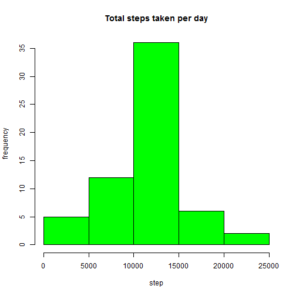

---
title: "Project 1"
---


#1-Loading and preprocessing the data

loading the library for plotting purpose :

```r
library(lattice) 
```
Reading the data ( data should already has bee downloaded in your directory)
My directory is a file named Hassan located in the Desktop


```r
setwd("C:\\Users\\hassan\\Desktop\\TEST")
getwd()
dir()
data<-read.csv("activity.csv",header=T,sep=",")
names(data)
dim(data)
```
# 2-Histogram of the total number of steps taken each day


```r
m11<-aggregate(steps ~ date ,data, sum, na.rm=TRUE)

hist(m11$steps,xlab = "total steps",ylab="frequency",main="Total steps taken per day",
     col="blue")
```


#3-Mean and median number of steps taken each day


```r
meanh<-print( mean(m11$steps) )
```

```
## [1] 10766.19
```

```r
medianh<-print( median(m11$steps) )
```

```
## [1] 10765
```

The average number of steps taken each day was 10766 steps.

The median number of steps taken each day was 10765 steps.


#4-Time series plot of the average number of steps taken


```r
m22<-aggregate(steps ~interval, data,mean, na.rm=TRUE)

plot(x=m22$interval,y=m22$steps,type="l",
     xlab = "Interval time",ylab="Average steps",
     main="the average Total steps versus interval time",
     col="red")
```


#5- The 5-minute interval that, on average, contains the maximum number of steps

```r
Index<-max(m22$steps)
print( m22[ which (m22$steps==Index) , 1] )
```

```
## [1] 835
```

The 5-minute interval which had the maximum number of steps was the 835 interval.

#6-Code to describe and show a strategy for imputing missing data

Create a new dataset that is equal to the original dataset but with the missing data filled in.My strategy for filling in NAs will be to substitute the missing steps 
with the average of the (average of steps based on the day of the week).


```r
print( sum_na<-sum(is.na (data$steps)) ) 
```

```
## [1] 2304
```

```r
vec_na<-which(is.na (data$steps))

new_data<-data
new_frame<-aggregate(steps ~ date ,data, mean, na.rm=TRUE) 
na<-mean(new_frame$steps)


for (i in 1:length(vec_na)) {
new_data[vec_na[i],1]<-na }
```
The total number of rows with steps = 'NA' is 2304.

check whether all Na data were filled 

```r
sum_na<-sum(is.na (new_data[,1])) 
print(sum_na)
```

```
## [1] 0
```
After substittuting the NA values to the main data matrix , the number of NA values in 
the new data would be zaero.

#7-Histogram of the total number of steps taken each day after missing values are imputed

```r
frame_imput<-aggregate(steps ~ date ,new_data, sum, na.rm=TRUE)

hist(frame_imput$steps ,xlab = "step",ylab="frequency",main="Total steps taken per day",
     col="green")
```


the mean and median of the total steps taken each day

```r
mean_imput<-print(mean(frame_imput$steps))
```

```
## [1] 10766.19
```

```r
median_imput<-print(median(frame_imput$steps))
```

```
## [1] 10766.19
```
Both the average and the median of the total steps taken eah day after NAs are filled came out to be equal as 10766.19 .

Creating the histogram of total steps per day with/without imputing


```r
hist(frame_imput$steps, breaks=5, xlab="Steps",main="Total steps per day", col="red")
hist(m11$steps, breaks=5, xlab="Steps",main="Total steps per day" , col="blue", add=T)
legend("topright", c("without Na-data", " with NA-data"), fill=c("red", "blue")  )
```


#8-Panel plot comparing the average number of steps taken per 5-minute interval across weekdays and weekends


```r
new_data$date<-as.Date(new_data$date)
WD<-weekdays(new_data$date)
new_data$date<-WD

for (i in 1:length(WD)) {
        
        if(new_data[i,2]== "Saturday" | new_data[i,2]== "Sunday") {new_data[i,2]<-"weekend" }
            else {new_data[i,2]<-"weekday"}
}


meanmatrix<-aggregate(steps ~ interval+date ,new_data, mean)

xyplot(steps~interval | date, data=meanmatrix,facets= .~ date, type="l",layout = c(1,2),
       main="Average Steps per Interval Based on Type of Day", 
       ylab="Average Number of Steps", xlab="Interval")
```



So the average steps over the weekends show higher values than that of the weekdays.


